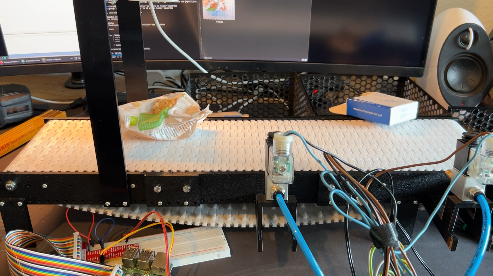

# 63184-fapra-ki-thema-1

Das Ziel des Projektes ist es, eine prototypische Fördereinrichtung zu erstellen,
welche vereinzelte Müllstücke transportiert. Die Müllstücke sollen
durch eine senkrecht über dem Förderband befestigte Kamera in Echtzeit
aufgenommen und durch einen KI-Basierten Bildverarbeitungsalgorithmus
ausgewertet werden. Die klassifizierten Müllstücke sollen anschließend durch
einen geeigneten Aktor vom Förderband entfernt und in die korrekte Müllgruppe
einsortiert werden.

Die Arbeit wurde im Rahmen des Moduls: “Fachpraktikum Softwareentwicklung
mit Methoden der Künstlichen Intelligenz” unter der Betreuung
von Dr. Otmane Azeroual erstellt. Die Aufgabenstellung mit dem Thema
„Automatisierte Mülltrennung und -entsorgung“ widmet sich, wie bereits
in vorherigen Kapiteln beschrieben, dem omnipräsenten Problem der Trennung
und Klassifizierung von kontinuierlich wachsenden Müllaufkommen.
Dieses Problem kann aus verschiedenen Blickwinkeln betrachtet und angegangen
werden, weswegen aus der Aufgabenstellung ein konkretes Vorgehen
und Projektziel abgeleitet wurde, welches in den nachfolgenden Abschnitten
beschrieben wird.

Das Projekt zielte auf die Automatisierung von Mülltrennung und -entsorgung ab und wurde erfolgreich als wissenschaftliche Arbeit veröffentlicht: "Intelligente Abfallwirtschaft: KI-gestützte Lösungen für automatisierte Mülltrennung und -entsorgung", Forschungsergebnisse zur Informatik, Band 75, Hamburg 2025 (ISBN 978-3-339-14368-6 Print / 978-3-339-14369-3 eBook). 

[Veröffentlichung](https://www.verlagdrkovac.de/978-3-339-14368-6.htm )

## Starten der Anwendung
Zum starten der Anwendung folgen Sie bitte den Readme-Dokumenten des Frontends und des Backends

* [Backend](./backend/readme.md)
* [Frontend](./frontend/README.md)

## Standardbenutzer für Demozwecke
Zu Demozwecken stehen die beiden Nutzer admin und user zur Verfügung.
Die Passwörter entnehmen Sie bitte der env Datei des Backends.
[env](./backend/.env)
## Das vollständige Projekt-Demo
Das vollständige Projekt-Demo ist unter folgendem Link verfügbar:
[Video]https://drive.google.com/file/d/1swre4n_bvmbfQ7RDnxKk2m0LNGvAy1_f/view?usp=sharing

## Demo ohne Hardware
Ein detaillierte Demo-Video ohne Hardwareeinsatz wurde von unserem Teammitglied Herrn Teusch aufgenommen und ist unter folgendem Link einsehbar:
[Video](https://drive.google.com/file/d/1pbjZJ15CWwCAsQgvGXcbOX_87T2dLDAh/view)